<h1 align="center">Movie Ticket-Booking</h1>
Movie ticket booking web application with MERN stack (MongoDB, Express, React, NodeJS) & Tailwind CSS

## Table of Contents
* [Project Purpose](#project-purpose)
* [Technologies](#technologies)
* [Quick Tour](#quick-tour)
* [Guideline](#guideline)
* [How to run the app](#how-to-run-the-app)

## Project Purpose
The purpose of this project is to improve my full-stack web development skills, learning front-end technologies like React and Tailwind CSS, and backend technologies like Node.js, Express, and MongoDB.

## Technologies
* React
* React Router Dom 
* React Hook Form 
* Tailwind CSS 
* Vite 
* NodeJS
* Mongoose 
* Express 
* MongoDB
* And more...

## Quick Tour
<h2 align="center">Login Page</h2>
<p align="center">
    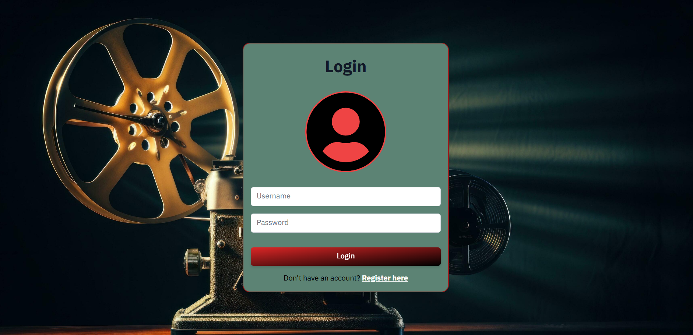
</p>
<h2 align="center">Register Page</h2>
<p align="center">
    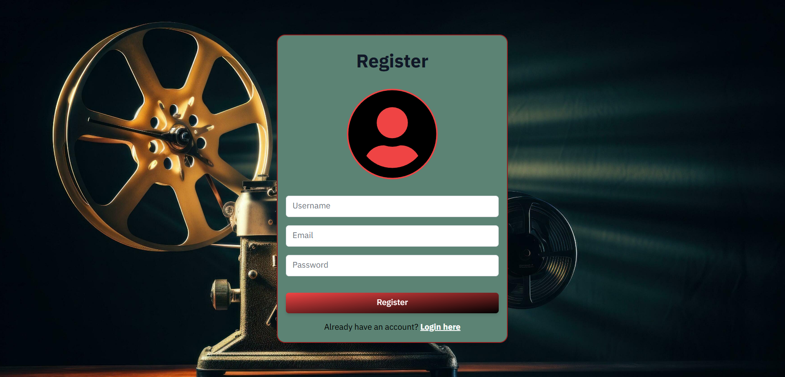
</p>
<h2 align="center">Home Page 🍿</h2>
<p align="center">
    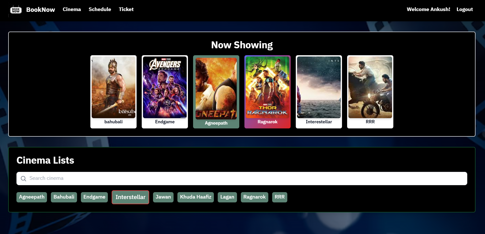
</p>
<h2 align="center">Cinema Page</h2>
<p align="center">
    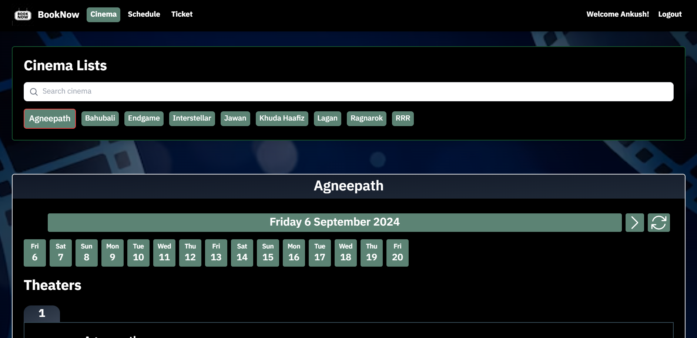
    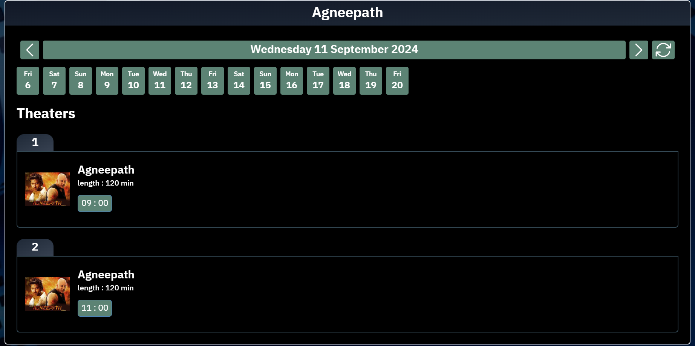
</p>
<h2 align="center">Schedule Page</h2>
<p align="center">  
    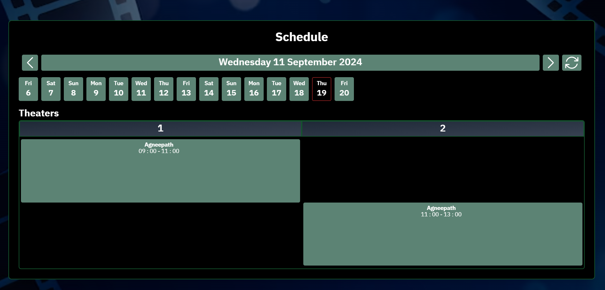
</p>
<h2 align="center">Ticket Page 🎟️</h2>
<p align="center">  
    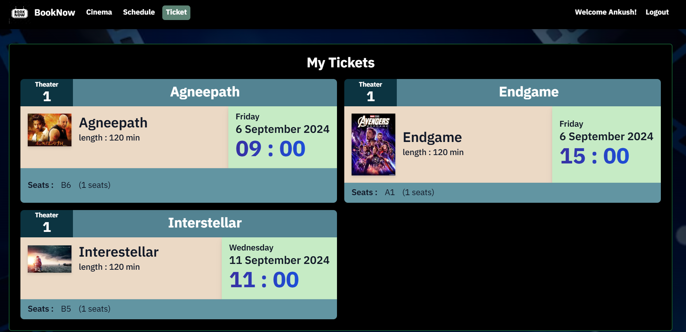
</p>
<h2 align="center">Add Movie 🎬</h2>
<p align="center">  
    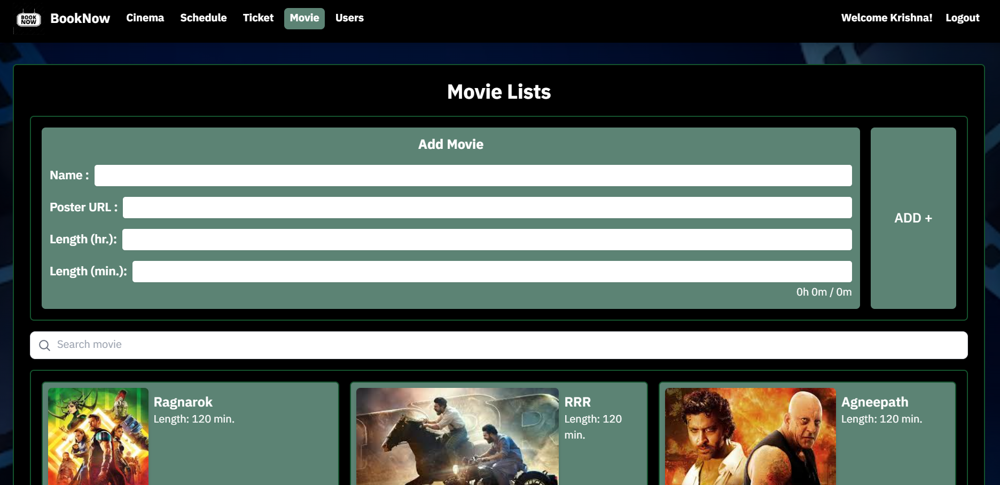
</p>
<h2 align="center">Add Cinema 🎬</h2>
<p align="center">  
    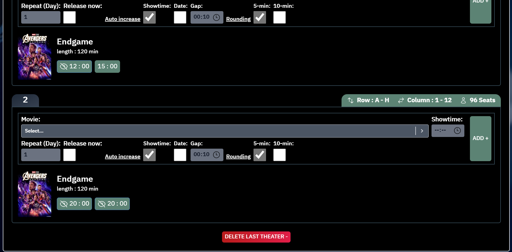
</p>
<h2 align="center">Add Schedule</h2>
<p align="center">  
    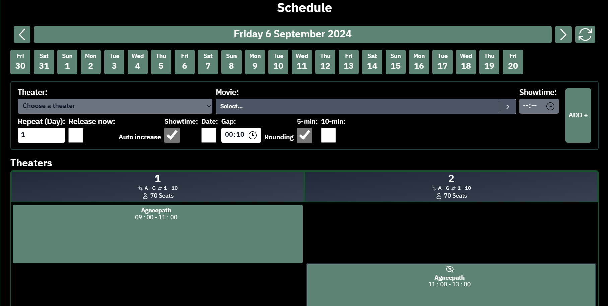
</p>

<h2 align="center">Responsive Design</h2>
<p align="center">
    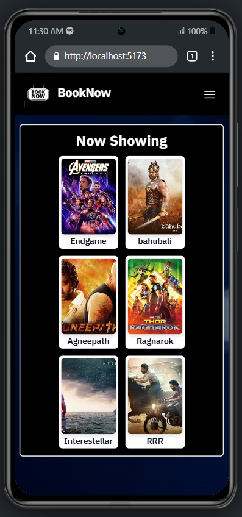
    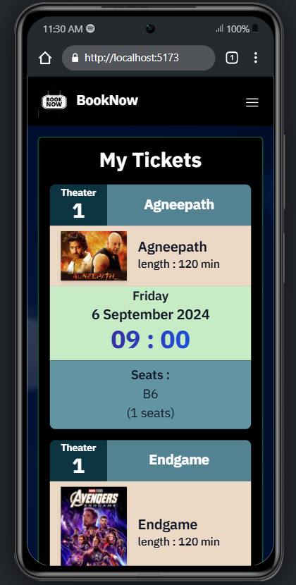
</p>

## Guideline

### Roles:-
<h2>User (not Logged in)</h2>

* View released showtimes by choosing from
<br> &emsp;- Movie in home page <br>  &emsp;- Cinema's theater in cinema page <br> &emsp;- Cinema's schedule in schedule page <br>
* View released showtimes for today and the future
* View seats for released showtimes on the showtime page

<h2>User (Logged in)</h2>

* All Viewer permissions
* Purchase tickets on the showtime page
* View purchased tickets on the ticket page
<h2>Admin </h2>

* All User permissions
* View all showtimes for any date
* Manage cinemas
* Manage theaters
* Manage showtimes
* Manage movies
* Manage user & admin


## How to run the app
1. Download the code
2. Create .env file in /server
```
PORT=8080
DATABASE=<your MongoDB connection string URI>
JWT_SECRET=<any random JWT secret>
JWT_EXPIRE=30d
JWT_COOKIE_EXPIRE=30
```
3. Start server side
```
cd server
npm install
npm start
```
4. Start client side
```
cd client
npm install
npm run dev
```